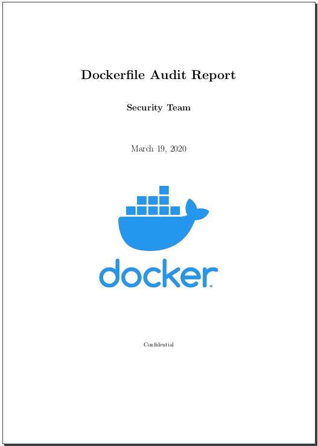
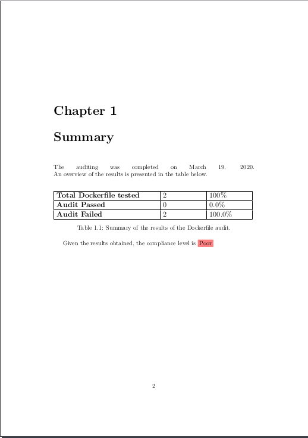
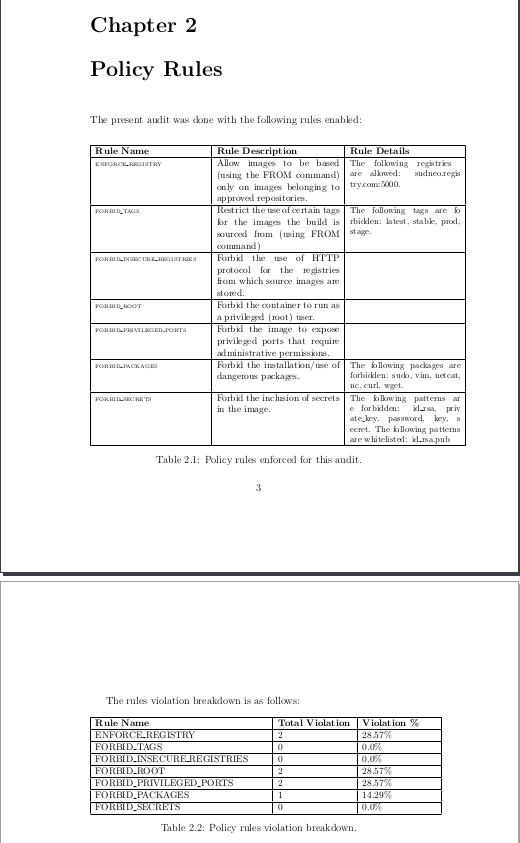
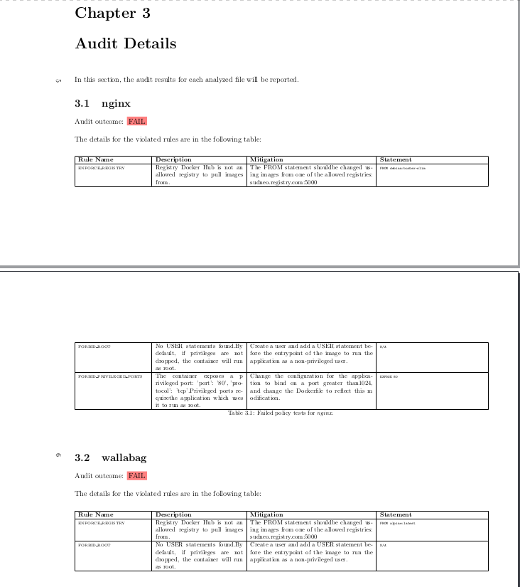

# Dockerfile-audit

This tool aims to provide an extensible and straightforward way to perform targeted and mass auditing of Dockerfile's.
The main idea is not to focus on linting or syntax, but to focus on semantic, trying to prevent insecure images from being built.

dockerfile-audit uses its own grammar to parse valid Dockerfiles and deconstruct all directives. After this is done, a 
defined set of policy rules can be benchmarked against scanned files. It is possible also to use this tool simply to parse 
the Dockerfile for own purposes, without the Policy component.

## Policy Rules

The set of rules can be easily extended, and at the moment includes:

* Enforcing the use of certain registries for the FROM commands. Many times, to ensure compliance, it is required that
images are built only from trusted sources (i.e., private registry). Images in a trusted registries are for example signed
and vulnerability scanned. Thus, it is desirable to enforce that all images built by an organization, source from trusted 
images.
* Restricting the use of certain tags for the FROM commands. Floating tags, such as *latest* or *stable* are dangerous as
tend to change over time. Building the same image FROM image:latest can land different results depending on the build time.
This rule forbids the use of tags specified in the policy.
* Restricting the use of insecure registries. While HTTPs is the default for most Docker registry solution, it is possible
to run a registry on HTTP. This rules forbids the use of HTTP.
* Restricting the image from running as root. By default, if no USER instructions are declared, the resulting image will
run as a privileged user, which poses obvious security risks. This rules requires that at least a USER instruction is present
and that this does not use *root* or uid *0*.
* Restrict the use of privileged ports. Ports < 1024 require administrative privileges for the application which is binding
on them. Since container ports can be mapped easily (either with docker, docker-compose or Kubernetes) to external ports,
applications very rarely need to run with elevated privileges in order to bind on those ports.
* Restricting the use of some packages. Some OS packages such as *sudo* are very rarely needed inside Docker images. This rule
attempts to restrict the inclusion of such packages into the image.
* Restricting the inclusion of secrets. It is not uncommon to simplify development to include a secret/password inside
an image by the means of ADD or COPY directive. This rule uses a user-defined set of patterns that will be restricted from
being added or copied inside the image.

## Use

In order to use dockerfile-audit do the following:

```bash
git clone https://github.com/Sudneo/dockerfile-audit
cd dockerfile-audit
pip install -r requirements.txt
```

If you want to generate reports you need to also have `pdflatex` installed.

```bash
$ python dockerfile-audit.py -h
usage: dockerfile-audit.py [-h] [-p POLICY] (-d DOCKERFILE | -b BATCH) [-r]
                           [-n REPORT_NAME] [-t REPORT_TEMPLATE]

optional arguments:
  -h, --help            show this help message and exit
  -p POLICY, --policy POLICY
                        The dockerfile policy to use for the audit.
  -d DOCKERFILE, --dockerfile DOCKERFILE
                        The Dockerfile to audit.
  -b BATCH, --batch BATCH
                        A directory in which all files will be audited.
  -r, --report          Generate a PDF report about the findings
  -n REPORT_NAME, --report-name REPORT_NAME
                        The name of the PDF report.
  -t REPORT_TEMPLATE, --report-template REPORT_TEMPLATE
                        The template for the report to use
```

By default the report template is the one included in `templates/report-template.tex`, the report generated is called
`report.pdf` and the default policy `policy.yaml` is used.

To scan a single file:

```bash
python dockerfile-audit.py -d Dockerfile -r
```

To scan a directory in which every file is a Dockerfile (with its own name):

```bash
python dockerfile-audit.py -b /tmp/dockerfiles -r
```

An example of the report can be found in the `docs` folder. 

### Screenshots









### Technical information

Opinionated choices:

In order to greatly simplify the parsing, each Dockerfile is pre-processed before being parsed.
Preprocessing does the following actions:
* Removes comments
* Replaces line continuations (\ \n) with simple space
* Replaces multiple spaces with a single space
* Removes new lines at the beginning of the file

### Roadmaps

#### Implementation Roadmap

- [X] FROM
- [X] RUN
- [X] CMD
- [X] LABEL
- [X] MAINTAINER
- [X] EXPOSE
- [X] ENV
- [X] ADD
- [X] COPY
- [X] ENTRYPOINT
- [X] VOLUME
- [X] USER
- [X] WORKDIR
- [X] ARG
- [ ] ONBUILD
- [X] STOPSIGNAL
- [ ] HEALTHCHECK
- [X] SHELL
- [X] COMMENTS

#### Policy Roadmap

- [X] Enforce registries
- [X] Forbids tags
- [X] Forbid root User
- [X] Forbid privileged ports
- [X] Forbid Packages
- [X] Forbid secrets

#### General Improvements

- [ ] Parsing in stages could lead to better results. For example, first parse all ENV variables, replace
the value of the declared variables everywhere, and then proceed with parsing.
- [ ] RUN/CMD/ENTRYPOINTS command are harder to parse. If a package is installed and then removed, the search will
find 2 matches, while the package is correctly removed. Implementing RUN/CMD/ENTRYPOINT specific parsing might
allow to find out if package is installed and then removed.
- [ ] Use shlex for better RUN parsing
- [ ] Allow --json format in alternative to report to produce simply a json of the result
- [ ] Allow --parse format in alternative to report to simply return the parsed Dockerfile
- [X] Optimize Grammar, remove duplicate terminals and reduce the number of rules.
- [X] Implement comments parsing between RUN multiline commands.
- [X] Review RUN command parsing
- [X] FROM command breaks when registry has more than a "/"
- [X] LABEL sometimes breaks
- [ ] COPY --from options
- [X] FIX EXPOSE command
- [ ] EXPOSE command, when used with $VARIABLE doesn't support `/protocol` syntax

#### Eventual Features:

- [ ] Support $( ) arguments to commands (e.g., USER $(user:-user))
